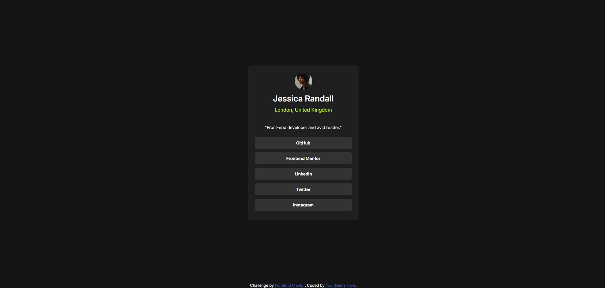

# Frontend Mentor - Social Links Profile Solution


## Welcome! 👋

Thanks for checking out my front-end coding challenge solution.

This is a solution to the [Social Links Profile challenge on Frontend Mentor](https://www.frontendmentor.io/challenges/social-links-profile-UG32l9m6dQ). Frontend Mentor challenges help you improve your coding skills by building realistic projects.

---

## Table of contents

- [Overview](#overview)
  - [The Challenge](#the-challenge)
  - [Screenshot](#screenshot)
  - [Links](#links)
- [My Process](#my-process)
  - [Built With](#built-with)
  - [What I Learned](#what-i-learned)
  - [Continued Development](#continued-development)
  - [Useful Resources](#useful-resources)
- [Author](#author)

---

## Overview

### The Challenge

Users should be able to:

- See hover and focus states for all interactive elements on the page.

### Screenshot



### Links

- Solution URL: [https://github.com/Mater9/social-links-profile-main]
- Live Site URL: [https://mater9.github.io/social-links-profile-main/]

---

## My Process

### Built With

- Semantic HTML5 markup
- CSS custom properties
- Flexbox
- Mobile-first workflow

### What I Learned

Through this project, I improved my skills in **flexbox layout**, **CSS transitions**, and **semantic HTML** structuring. Here are some highlights:

```css
.btn {
  background-color: hsl(0, 0%, 20%);
  color: #fff;
  font-size: 12px;
  font-weight: 700;
  padding: 10px;
  text-decoration: none;
  margin: 5px 0;
  border-radius: 8px;
  width: 100%;
  text-align: center;
  cursor: pointer;
  transition: background-color 0.3s;
}
```

This CSS snippet demonstrates how I used transitions to create smooth hover effects and improved button aesthetics with rounded corners.

### Continued Development

I plan to continue refining my **responsive design** techniques and explore more advanced CSS features like **grid layouts** and **animations**.

### Useful Resources

- [CSS Tricks - A Complete Guide to Flexbox](https://css-tricks.com/snippets/css/a-guide-to-flexbox/) - This guide helped me understand flexbox better.
- [MDN Web Docs](https://developer.mozilla.org/en-US/) - Always a reliable resource for web development concepts.

---

## Author

- Frontend Mentor - [@yourusername](https://www.frontendmentor.io/profile/yourusername)
- Twitter - [@yourusername](https://www.twitter.com/yourusername)

---

Feel free to reach out if you have any feedback or suggestions! 🚀
